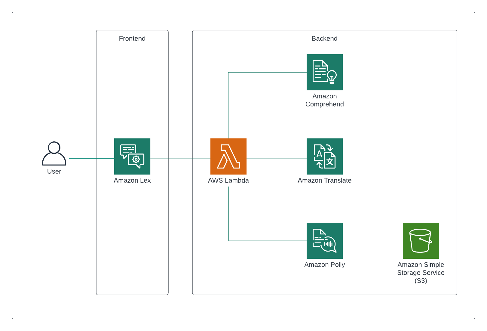

# zobot
Chatbot Translator App with AWS, Golang and Terraform

 

## Prerequisites 

| Tools     | Version   |
|-----------|-----------|
| Go        | `>= 1.20.3` |
| Terraform | `>= 1.5.0`  |

## AWS Services 

| Service            | Description                                              |
|--------------------|----------------------------------------------------------|
| Amazon Comprehend  | Detect the language source                               |
| Amazon Translate   | Translate user-generated content                         |
| Amazon Polly       | Turn text into life-like speech                          |
| Amazon Lex         | Build bots with Conversational AI                        |
| Amazon S3          | Object storage                                           |
| AWS Lambda         | Run code without provisioning or managing infrastructure |

---

# What is zobot?

**zobot** is a multilingual chatbot application powered by AWS and written in Go. It uses Amazon Web Services to interact with users, translate text and turn it into lifelike audio.

## HLA

### How zobot works?
- You talk to **zobot** by interacting with Amazon Lex bot.
- With AWS Comprehend, **zobot** detects the language you're using.
- **zobot** uses Amazon Translate to translate your words into a desired language.
- With AWS Polly, **zobot** transforms the translated text with the correct pronunciation into a lifelike speech.
- **zobot** keeps all audio messages in an S3 bucket.

#### Supported Languages
- English
- Spanish
- French

---

## Testing
Unit tests and [mocks](/backend/mock_client_ops.go) can be found [here](/backend).

---

# References

### AWS SDK for Go

- [AWS SDK Go v2 Reference](https://pkg.go.dev/github.com/aws/aws-sdk-go-v2#section-readme)
- [`translate` API client](https://pkg.go.dev/github.com/aws/aws-sdk-go-v2/service/translate)
- [`polly` API client](https://pkg.go.dev/github.com/aws/aws-sdk-go-v2/service/polly)
- [`s3` API client](https://pkg.go.dev/github.com/aws/aws-sdk-go-v2/service/s3)

### AWS Documentation

- [Amazon Comprehend](https://aws.amazon.com/comprehend/)
- [Amazon Translate](https://aws.amazon.com/translate/)
- [Amazon Polly](https://aws.amazon.com/polly/)
- [Amazon Lex](https://aws.amazon.com/lex/)
- [Amazon S3](https://aws.amazon.com/s3/)
- [AWS Lambda](https://aws.amazon.com/lambda/)

- [Amazon - Translate Supported Languages](https://docs.aws.amazon.com/translate/latest/dg/what-is-languages.html)
- [Amazon Polly -  Voice List](https://docs.aws.amazon.com/polly/latest/dg/voicelist.html)
- [Amazon Polly - Supported Languages](https://docs.aws.amazon.com/polly/latest/dg/SupportedLanguage.html)

### Other
- [trufflehog](https://github.com/trufflesecurity/trufflehog) - Secrets/Security Scan
- [snyk](https://github.com/snyk/actions) - Code Vulnerabilities Scan

---
