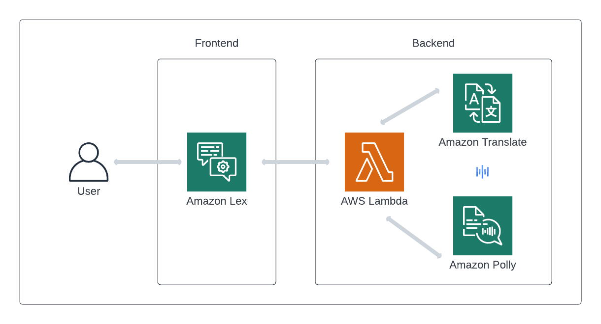

# zobot
Chatbot Translator App with AWS, Golang and Terraform

# Overview
## Prerequisites 

| Tools     | Version   |
|-----------|-----------|
| Go        | `>= 1.20.3` |
| Terraform | `>= 1.5.0`  |

## AWS Services 

| Service            | Description                                              |
|--------------------|----------------------------------------------------------|
| Amazon Comprehend  | Detect the language source                               |
| Amazon Translate   | Translate user-generated content                         |
| Amazon Polly       | Turn text into life-like speech                          |
| Amazon Lex         | Build bots with Conversational AI                        |
| Amazon S3          | Object storage                                           |
| AWS Lambda         | Run code without provisioning or managing infrastructure |

---

## HLA

Supported Languages:
- English
- Spanish
- French

---

## Testing

Table-driven unit tests can be found [here](/backend).

# References

## AWS SDK for Go

- [AWS SDK Go Reference](https://pkg.go.dev/github.com/aws/aws-sdk-go-v2#section-readme)
- [`translate` API client](https://pkg.go.dev/github.com/aws/aws-sdk-go-v2/service/translate)

## AWS Documentation

- [Amazon Comprehend](https://aws.amazon.com/comprehend/)
- [Amazon Translate](https://aws.amazon.com/translate/)
- [Amazon Polly](https://aws.amazon.com/polly/)
- [Amazon Lex](https://aws.amazon.com/lex/)
- [Amazon S3](https://aws.amazon.com/s3/)
- [AWS Lambda](https://aws.amazon.com/lambda/)
---
- [Translate Supported Languages](https://docs.aws.amazon.com/translate/latest/dg/what-is-languages.html)
- [Polly Voice List](https://docs.aws.amazon.com/polly/latest/dg/voicelist.html)
- [Polly Supported Languages](https://docs.aws.amazon.com/polly/latest/dg/SupportedLanguage.html)

## Other

- [trufflehog](https://github.com/trufflesecurity/trufflehog) - Secrets/Security Scan
- [snyk](https://github.com/snyk/actions) - Code Vulnerabilities Scan
